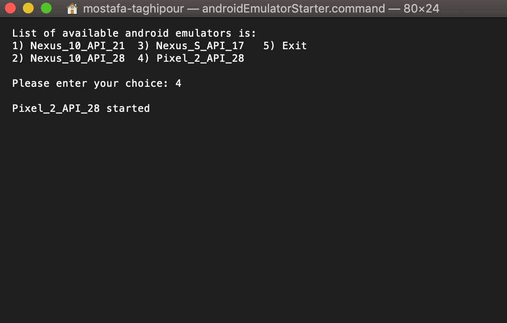

# My assistants in Android development

In this repository, there is a list of tools to accelerate the development of Android apps

## Android Studio Plugins
- [WIFI ADB ULTIMATE](https://github.com/huazhouwang/WIFIADB/tree/master/WIFIADBIntelliJPlugin)
- [Android drawable preview plugin](https://github.com/mistamek/Android-drawable-preview-plugin)
- [Name That Color](https://github.com/galex/name-that-color-intellij-plugin)
- [JSON To Kotlin Class ](https://plugins.jetbrains.com/plugin/9960-json-to-kotlin-class-jsontokotlinclass-)
- [String Manipulation](https://plugins.jetbrains.com/plugin/2162-string-manipulation)
- [TranslationPlugin](https://github.com/YiiGuxing/TranslationPlugin)
- [Key Promoter X Plugin](https://github.com/halirutan/IntelliJ-Key-Promoter-X)
- [stackoverflow](https://plugins.jetbrains.com/plugin/9513-stackoverflow)
- [GoogleIt](https://plugins.jetbrains.com/plugin/7402-googleit)


## Launch android emulators from command line
- Download [Android simulator launcher script](scripts/androidEmulatorStarter.command)
- Navigate to the location of the script file you just downloaded using Terminal and change its permissions using:
```
chmod +x androidEmulatorStarter.command
```
- Now, if you need to Launch android emulators, just click on the 'androidEmulatorStarter.command' file and choose one of the available options


## Computing your app's hash string (for sms retriever)
- Download [app hash string script](scripts/sms_retriever_hash_v9.sh)
- Navigate to the location of the script file you just downloaded using Terminal and change its permissions using:
```
chmod +x sms_retriever_hash_v9.sh
```
- Now script is ready, open terminal on run script:
```
sh sms_retriever_hash_v9.sh --package "com.your.packagename" --keystore /path/to/your.keystore
```


## Author

Mostafa Taghipour, mostafa@taghipour.me

## License

Copyright © 2019 Mostafa Taghipour. 

[LICENSE]: LICENSE
